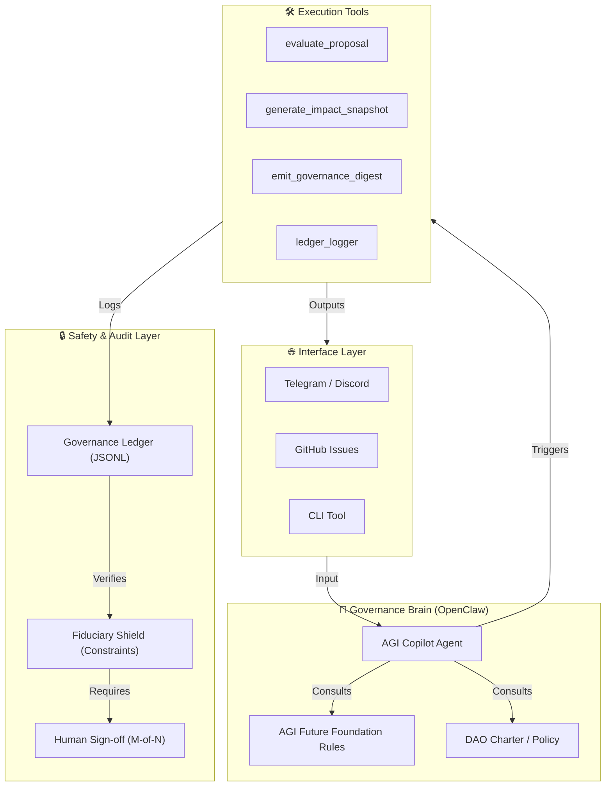

# AGI Governance Copilot 🛡️🏛️

> **An OpenClaw-powered agentic governance assistant for DAOs and public-goods funds — built on the
AGI Future Foundation's Institutional AGI, Fiduciary Shield, and Governance Engine frameworks.**

[](LICENSE)
[](https://github.com/gcc-foundation/openclaw)
[](https://www.gccofficial.org/en)
[](https://github.com/AGI-Corporation/agi-governance-copilot/wiki)

---

## 🌐 Overview

The **AGI Governance Copilot** is the first reference implementation of the [AGI Future Foundation PBC](https://www.agifuturefoundation.org)'s **Institutional AGI** governance architecture. By leveraging the [OpenClaw](https://github.com/gcc-foundation/openclaw) framework, it provides a transparent, auditable, and safe way for decentralized organizations to:

*   **Triage Proposals**: Automatically evaluate governance requests against complex fiduciary and public-benefit rules.
*   **Allocate Grants**: Structure milestone-based funding pipelines with AI-generated decision memos.
*   **Track Impact**: Monitor project progress via **Impact Snapshots** and verifiable performance scoring.
*   **Audit Everything**: Maintain a tamper-evident **Governance Ledger** for every agent action.

> [!IMPORTANT]
> **The agent is advisory-only.** It drafts recommendations, but never autonomously executes fund transfers or on-chain writes. **Humans decide.**

---

## 🏗️ System Architecture



---

## 🏆 GCC Agentic Public Goods Track

Built for the **GCC Agentic Public Goods** hackathon, focusing on transparent grant workflows and fiduciary AI safety.

| Feature | Implementation | Goal |
| :--- | :--- | :--- |
| **DAO Governance** | Automated proposal ingestion & rule compliance checks. | Efficiency |
| **Fund Allocation** | Tranche-based grant recommendations + milestone gates. | Accountability |
| **Impact Evaluation** | AI-generated **Impact Snapshots** with progress scoring. | Transparency |
| **Safety & Trust** | Advisory-only mode + tamper-evident Governance Ledger. | Trust |

---

## 🧠 Core Frameworks

This project operationalizes the [AGI Future Foundation](https://www.agifuturefoundation.org) concepts:

*   **Fiduciary Shield**: A set of hard-coded agentic constraints ensuring no unilateral financial access.
*   **Institutional Grid**: A structured repository of public-benefit obligations that the AI must cite in every decision.
*   **M.I.K.E. Framework**: Master Intelligence & Knowledge Executive — orchestrating specialized AI personas for domain-specific review.
*   **Governance Ledger**: A cryptographically hashed log of all AI reasoning steps, inputs, and outputs.

---

## 🚀 Getting Started

### 📋 Prerequisites
*   Python 3.11+
*   OpenClaw (`pip install openclaw`)
*   OpenAI / Anthropic API Key

### 🛠️ Installation
```bash
git clone https://github.com/AGI-Corporation/agi-governance-copilot.git
cd agi-governance-copilot
pip install -r requirements.txt
```

### ⚙️ Configuration
```bash
cp config/agent-config.example.yaml config/agent-config.yaml
# Add your API keys and define your DAO_CHARTER_PATH
```

---

## 📊 Usage

### 1. Evaluate a Grant Proposal
```bash
python src/main.py evaluate --proposal examples/sample-proposal.json
```
*Output: Structured compliance report with specific rule citations.*

### 2. Generate Impact Snapshot
```bash
python src/main.py impact --project examples/sample-project-update.json
```
*Output: A Markdown summary of project health, risks, and milestone progress.*

### 3. Emit Governance Digest
```bash
python src/main.py digest
```
*Output: Weekly summary sent to configured Telegram/Discord channels.*

---

## 🔒 Safety & Fiduciary Design

We implement a **Tri-Layer Safety Model**:

1.  **Input Filtering**: All inputs are sanitized and checked for prompt injection or policy-violating requests.
2.  **Context Injection**: Every tool call is pre-loaded with the **Fiduciary Shield** ruleset, preventing the LLM from "forgetting" its advisory-only role.
3.  **Audit Trail**: The `governance-ledger.jsonl` provides a permanent, verifiable record of every recommendation.

---

## 📈 Roadmap

*   **Q2 2025**: MVP with GitHub Issue integration & basic proposal evaluation.
*   **Q3 2025**: Multi-agent persona orchestration (M.I.K.E. framework implementation).
*   **Q4 2025**: Integration with on-chain oracle for milestone verification (OpenClaw-to-Chain).
*   **2026**: Full Institutional AGI deployment for global public goods funds.

---

## 🤝 Contributing

We welcome contributions! Please see our [Wiki](https://github.com/AGI-Corporation/agi-governance-copilot/wiki) for deep technical specs.

1.  Fork the repo.
2.  Create your feature branch.
3.  Ensure your code maintains the **advisory-only** safety model.
4.  Submit a PR with a detailed description.

---

## ⚖️ License

Distributed under the MIT License. See `LICENSE` for more information.

---

## 🔗 Links

*   **GCC Foundation**: [gccofficial.org](https://www.gccofficial.org/en)
*   **OpenClaw**: [github.com/gcc-foundation/openclaw](https://github.com/gcc-foundation/openclaw)
*   **AGI Future Foundation**: [agifuturefoundation.org](https://www.agifuturefoundation.org)
