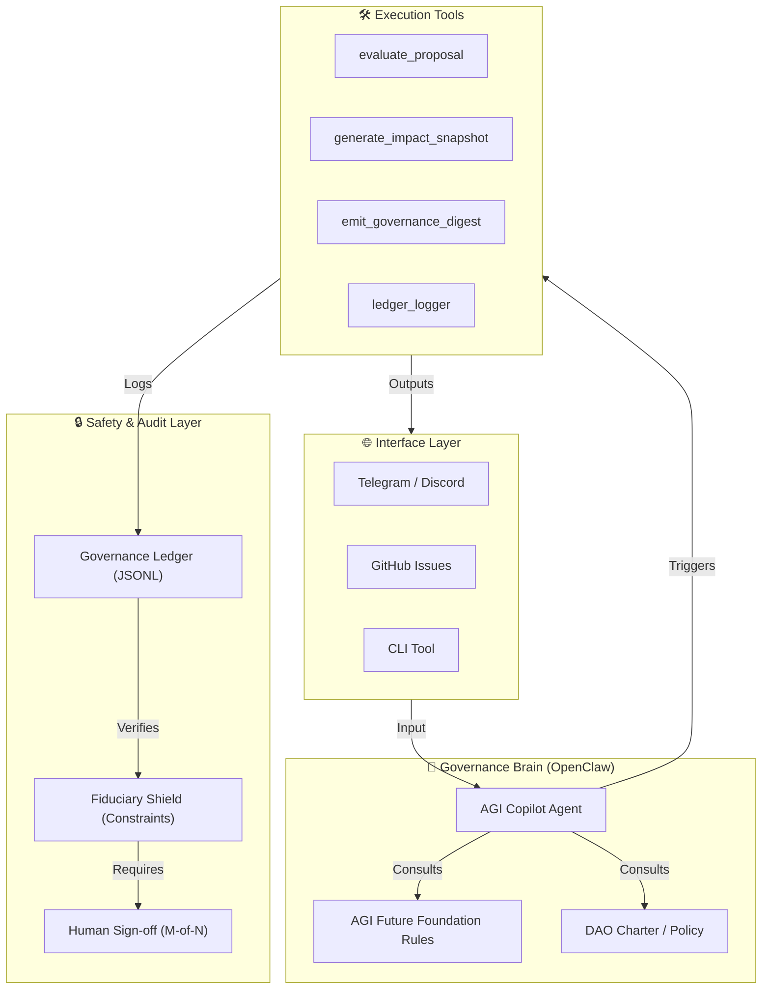
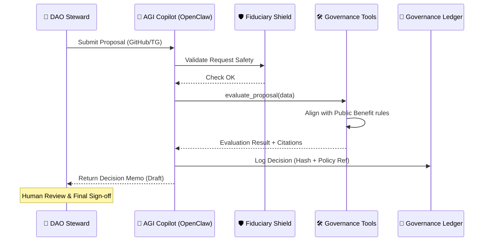
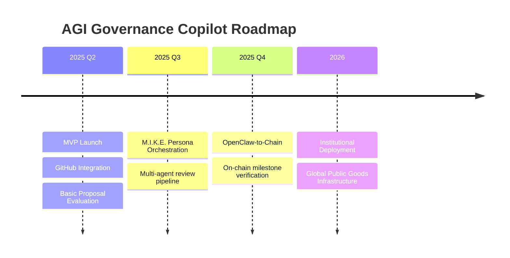

<p align="center">
  
</p>

# AGI Governance Copilot 🛡️🏛️

> **An OpenClaw-powered agentic governance assistant for DAOs and public-goods funds — built on the AGI Future Foundation's Institutional AGI, Fiduciary Shield, and Governance Engine frameworks.**

[](LICENSE)
[](https://github.com/gcc-foundation/openclaw)
[](https://www.gccofficial.org/en)
[](https://github.com/AGI-Corporation/agi-governance-copilot/wiki)

---

## 🌐 Overview

The **AGI Governance Copilot** is the first reference implementation of the [AGI Future Foundation PBC](https://www.agifuturefoundation.org)'s **Institutional AGI** governance architecture. By leveraging the [OpenClaw](https://github.com/gcc-foundation/openclaw) framework, it provides a transparent, auditable, and safe way for decentralized organizations to:

*   **Triage Proposals**: Automatically evaluate governance requests against complex fiduciary and public-benefit rules.
*   **Allocate Grants**: Structure milestone-based funding pipelines with AI-generated decision memos.
*   **Track Impact**: Monitor project progress via **Impact Snapshots** and verifiable performance scoring.
*   **Audit Everything**: Maintain a tamper-evident **Governance Ledger** for every agent action.

---

## 🏗️ System Architecture



### 🔄 Proposal Decision Flow


---

## 🏆 GCC Agentic Public Goods Track

Built for the **GCC Agentic Public Goods** hackathon, focusing on transparent grant workflows and fiduciary AI safety.

| Feature | Implementation | Goal |
| :--- | :--- | :--- |
| **DAO Governance** | Automated proposal ingestion & rule compliance checks. | Efficiency |
| **Fund Allocation** | Tranche-based grant recommendations + milestone gates. | Accountability |
| **Impact Evaluation** | AI-generated **Impact Snapshots** with progress scoring. | Transparency |
| **Safety & Trust** | Advisory-only mode + tamper-evident Governance Ledger. | Trust |

---

## 🧠 Core Frameworks

This project operationalizes the [AGI Future Foundation](https://www.agifuturefoundation.org) concepts:

*   **Fiduciary Shield**: Hard-coded constraints ensuring the agent never unilaterally moves funds.
*   **Institutional Grid**: A structured repository of public-benefit obligations cited in every decision.
*   **M.I.K.E. Framework**: Master Intelligence & Knowledge Executive — orchestrating specialized AI personas.
*   **Governance Ledger**: A cryptographically hashed log of all AI reasoning steps.

---

## 🚀 Getting Started

### 📋 Prerequisites
*   Python 3.11+
*   OpenClaw (`pip install openclaw`)
*   OpenAI / Anthropic API Key

### 🛠️ Installation
```bash
git clone https://github.com/AGI-Corporation/agi-governance-copilot.git
cd agi-governance-copilot
pip install -r requirements.txt
```

---

## 📊 Usage Examples

### 1. Evaluate a Grant Proposal
```bash
python src/main.py evaluate --proposal examples/sample-proposal.json
```

**Example Agent Output (Impact Card):**
```markdown
### 🟢 Proposal Evaluation: Project 'Solar-Mesh'
- **Status**: RECOMMEND PASS
- **Alignment Score**: 9.2/10
- **Fiduciary Check**: Valid (No direct transfer requested)
- **Policy Citation**: Institutional Grid Clause 4.2.1 (Open Source Mandate)
- **Recommended Tranches**: 
  1. $5k on GitHub Repo Initialization
  2. $10k on MVP release
```

### 2. Generate Impact Snapshot
```bash
python src/main.py impact --project examples/sample-project-update.json
```

---

## 🔒 Safety & Trust Design

| Layer | Mechanism | Safety Purpose |
| :--- | :--- | :--- |
| **Constraint** | Advisory-Only | Prevent unauthorized fund movement. |
| **Audit** | Governance Ledger | Tamper-evident record of all AI logic. |
| **Policy** | Rule Grounding | Every output must cite the Institutional Grid. |
| **Human** | Human-in-the-loop | Final decision-making power rests with stewards. |

---

## 📈 Roadmap



---

## 🤝 Contributing

We welcome contributions! Please see our [Wiki](https://github.com/AGI-Corporation/agi-governance-copilot/wiki) for deep technical specs.

---

## ⚖️ License

Distributed under the MIT License. See `LICENSE` for more information.

---

## 🔗 Links

*   **GCC Foundation**: [gccofficial.org](https://www.gccofficial.org/en)
*   **OpenClaw**: [github.com/gcc-foundation/openclaw](https://github.com/gcc-foundation/openclaw)
*   **AGI Future Foundation**: [agifuturefoundation.org](https://www.agifuturefoundation.org)
